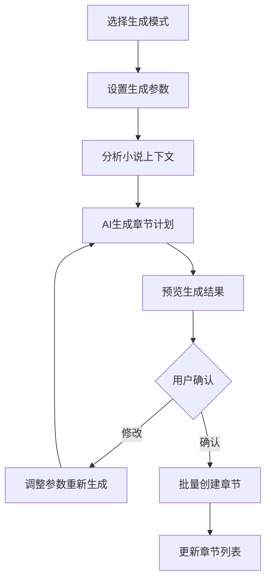
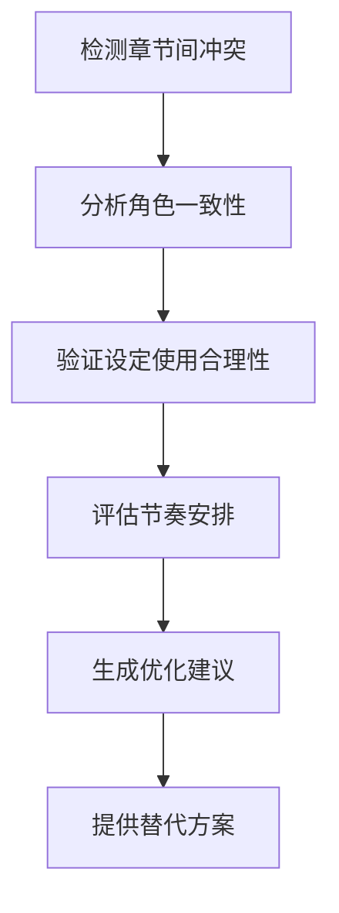

# AI批量章节创建功能设计文档

## 1. 功能概述

AI批量章节创建功能是一个智能化的章节生成系统，通过分析小说的现有内容、角色设定、世界观设定，运用AI的能力自动生成多个章节的标题、大纲和剧情要点，帮助作者快速构建小说结构。

## 2. 核心特性

### 2.1 智能分析与理解
- **小说上下文分析**：深度分析现有章节内容、角色关系、剧情发展
- **风格学习**：学习作者的写作风格、语言特点、章节结构偏好
- **设定整合**：自动整合角色设定、世界观设定到新章节中

### 2.2 多模式生成
- **续写模式**：基于现有章节续写后续剧情
- **插入模式**：在指定章节间插入新的剧情章节
- **分支模式**：生成不同的剧情分支选项
- **扩展模式**：将现有章节拆分为多个详细章节

### 2.3 智能规划
- **剧情一致性检查**：确保新生成章节与现有剧情逻辑一致
- **角色发展轨迹**：智能规划角色在各章节中的成长和变化
- **节奏控制**：根据小说类型智能调整章节间的节奏起伏

## 3. 技术架构

### 3.1 前端架构
```
BatchChapterCreator.vue
├── ChapterGenerationWizard.vue (创建向导)
├── NovelContextAnalyzer.vue (上下文分析器)
├── GenerationParametersPanel.vue (参数设置面板)
├── ChapterPreviewList.vue (预览列表)
└── BatchProgressTracker.vue (生成进度跟踪)
```

### 3.2 后端服务架构
```
/api/chapters/batch/
├── analyze - 分析小说上下文
├── generate - 生成章节批次
├── preview - 预览生成结果
├── apply - 应用生成结果
└── optimize - 优化建议
```

### 3.3 AI服务集成
- **内容分析服务**：分析现有小说内容和设定
- **章节生成服务**：基于分析结果生成新章节
- **一致性检查服务**：验证生成内容的逻辑一致性
- **优化建议服务**：提供改进建议和替代方案

## 4. 数据库设计扩展

### 4.1 批次生成记录表
```sql
model BatchChapterGeneration {
  id           String   @id @default(cuid())
  novelId      String
  userId       String
  batchName    String   // 批次名称
  mode         String   // continue, insert, branch, expand
  parameters   Json     // 生成参数（JSON）
  status       String   // pending, generating, completed, failed
  progress     Int      @default(0) // 0-100
  totalChapters Int     // 计划生成章节数
  completedChapters Int @default(0) // 已完成章节数
  createdAt    DateTime @default(now())
  updatedAt    DateTime @updatedAt

  novel        Novel    @relation(fields: [novelId], references: [id])
  user         User     @relation(fields: [userId], references: [id])
  generatedChapters GeneratedChapter[]
}
```

### 4.2 生成章节模板表
```sql
model GeneratedChapter {
  id              String   @id @default(cuid())
  batchId         String
  chapterNumber   Int
  title           String
  outline         String
  plotPoints      Json     // 剧情要点
  characters      Json     // 涉及角色
  settings        Json     // 使用设定
  estimatedWords  Int      // 预估字数
  priority        Int      // 重要性等级 1-5
  dependencies    Json     // 依赖的章节ID列表
  aiConfidence    Float    // AI生成信心度 0-1
  status          String   @default("draft") // draft, approved, rejected
  createdAt       DateTime @default(now())

  batch           BatchChapterGeneration @relation(fields: [batchId], references: [id])
}
```

## 5. AI提示词模板设计

### 5.1 上下文分析提示词
```
你是一个专业的小说分析助手。请分析以下小说内容：

**小说基本信息：**
- 标题：{{novel.title}}
- 类型：{{novel.genre}}
- 主题：{{novel.theme}}

**现有章节：**
{{existing_chapters}}

**角色设定：**
{{characters}}

**世界设定：**
{{world_settings}}

请分析：
1. 当前剧情发展阶段和主要冲突
2. 各角色的发展轨迹和关系变化
3. 世界观的展现程度和待发掘元素
4. 写作风格特点和章节结构特征
5. 潜在的剧情发展方向

输出JSON格式的分析结果。
```

### 5.2 章节生成提示词
```
基于以下分析结果，生成{{chapter_count}}个新章节：

**上下文分析：**
{{context_analysis}}

**生成参数：**
- 模式：{{mode}}
- 起始位置：{{start_position}}
- 目标字数：{{target_words_per_chapter}}
- 重点关注：{{focus_areas}}

请为每个章节生成：
1. 章节标题（富有吸引力且符合风格）
2. 详细大纲（300-500字）
3. 关键剧情点（3-5个）
4. 涉及角色及其作用
5. 使用的世界设定元素
6. 与其他章节的关联性
7. 预估字数和重要性等级

确保：
- 剧情逻辑连贯
- 角色行为合理
- 节奏张弛有度
- 设定使用恰当
```

## 6. 功能流程设计

### 6.1 批量创建流程


### 6.2 智能优化流程


## 7. 用户界面设计

### 7.1 批量创建向导
- **步骤1：选择模式**
  - 续写模式：继续当前剧情
  - 插入模式：在指定章节间插入
  - 分支模式：探索不同发展可能
  - 扩展模式：细化现有章节

- **步骤2：参数设置**
  - 生成章节数量（1-20）
  - 每章预期字数范围
  - 重点关注元素（角色、设定、剧情线）
  - 风格偏好调整

- **步骤3：上下文确认**
  - 显示AI分析的小说现状
  - 确认角色发展轨迹
  - 验证世界设定使用情况

- **步骤4：预览与调整**
  - 章节列表预览
  - 逐章详情查看
  - 支持单章重新生成
  - 批量调整功能

### 7.2 生成结果界面
- **章节概览面板**
  - 卡片式章节显示
  - 重要性等级指示
  - AI信心度显示
  - 依赖关系可视化

- **详情编辑面板**
  - 标题编辑
  - 大纲编辑
  - 剧情点调整
  - 角色关联管理

## 8. 高级特性

### 8.1 协作式优化
- **多轮对话优化**：与AI进行多轮对话完善章节内容
- **风格微调**：基于用户反馈调整AI生成风格
- **个性化学习**：记录用户偏好，逐步个性化生成

### 8.2 智能依赖管理
- **前置条件检查**：确保章节生成所需的角色和设定已存在
- **影响分析**：分析新章节对后续剧情的影响
- **连贯性维护**：自动调整相关章节以保持整体连贯性

### 8.3 多维度评估
- **创意指数**：评估章节的创新性和吸引力
- **可行性指数**：评估实施的技术难度
- **一致性指数**：评估与现有内容的一致性

## 9. 技术实现要点

### 9.1 性能优化
- **分批处理**：大量章节生成采用队列分批处理
- **缓存机制**：缓存分析结果和常用模板
- **异步生成**：前端显示进度，后端异步处理

### 9.2 错误处理
- **生成失败重试**：自动重试失败的章节生成
- **部分成功处理**：支持部分章节生成成功的情况
- **回滚机制**：支持撤销批量操作

### 9.3 扩展性设计
- **模板系统**：支持自定义生成模板
- **插件接口**：为第三方扩展预留接口
- **多模型支持**：支持切换不同的AI模型

## 10. 用户体验考虑

### 10.1 学习成本
- **引导教程**：首次使用提供详细引导
- **示例展示**：提供典型使用场景示例
- **帮助文档**：完整的功能说明文档

### 10.2 操作便利性
- **一键生成**：提供快速生成选项
- **模板保存**：保存常用的生成参数组合
- **历史记录**：记录生成历史便于复用

### 10.3 反馈机制
- **质量评价**：用户可对生成结果评分
- **改进建议**：收集用户改进建议
- **使用统计**：统计功能使用情况优化体验

---

**实施优先级：**
1. 基础批量创建功能（核心流程）
2. AI上下文分析和生成
3. 用户界面和交互优化
4. 高级特性和智能优化
5. 性能优化和扩展性完善

**预估开发周期：** 4-6周
**技术风险评估：** 中等（主要在AI模型调优和大规模数据处理）
**用户价值：** 极高（显著提升创作效率和灵感激发）