# AI小说创作协作工具 - 系统设计文档

# 1. 需求分析

## 1.1 用户画像

- 主要用户：小说作家
- 创作特点：边写边完善，注重角色和世界观一致性
- 协作需求：AI辅助内容生成和完善，类似代码编辑AI工具的体验

## 1.2 核心需求

| 需求类别 | 具体需求 | 优先级 |
|---------|---------|--------|
| 内容创作 | 概要 → AI完善章节/角色/设定 | 高 |
| AI协作 | 对话式交互，AI生成大纲和建议 | 高 |
| 数据管理 | 本地数据库存储，树状结构组织 | 高 |
| 一致性检查 | 实时角色/设定/剧情一致性验证 | 中 |
| 内容导出 | 支持EPUB/TXT格式，插图位置标记 | 中 |
| 创作约束 | 分级制度控制AI生成内容边界 | 低 |

## 1.3 功能规格

#### 1.3.1 核心功能模块

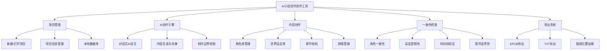

# 2. 系统架构设计

### 2.1 技术架构图

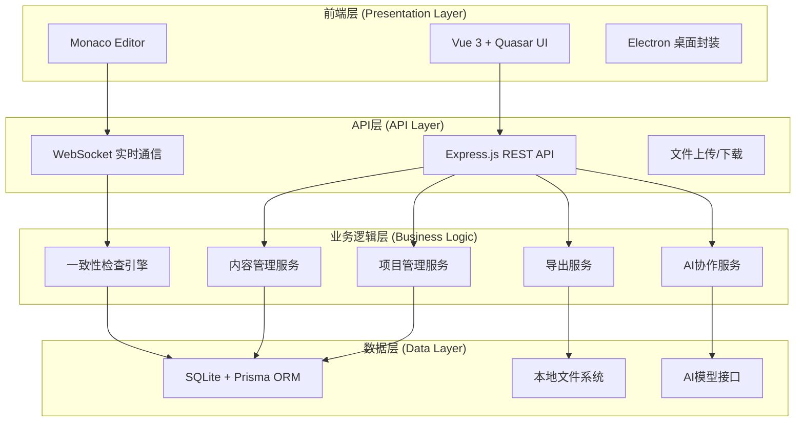

### 2.2 技术选型

| 技术层面 | 选择方案 | 理由 |
|---------|---------|------|
| 前端框架 | Vue 3 + Vite | 现代化、高性能、生态丰富 |
| UI框架 | Quasar Framework | 组件丰富、响应式设计 |
| 代码编辑器 | Monaco Editor | VSCode同款，支持语法高亮 |
| 桌面应用 | Electron | 跨平台、易集成Web技术 |
| 后端框架 | Node.js + Express | JavaScript全栈、快速开发 |
| 数据库 | SQLite + Prisma | 轻量、无服务器、类型安全 |
| AI服务 | OpenAI API | 成熟稳定、对话能力强 |
| 导出库 | epub-gen, fs-extra | 专业EPUB生成、文件操作 |

## 3. 数据库设计

### 3.1 数据模型关系图

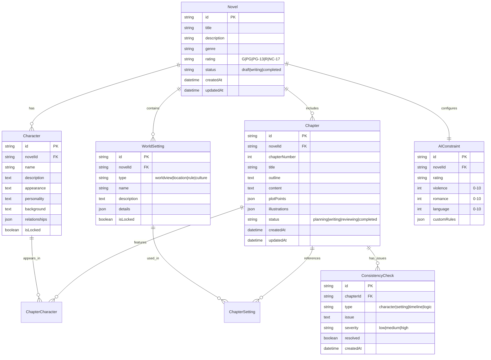

### 3.2 核心API接口设计

#### 3.2.1 项目管理API

```text
# 项目基础操作
POST   /api/novels                    # 创建新项目
GET    /api/novels                    # 获取项目列表
GET    /api/novels/:id                # 获取项目详情
PUT    /api/novels/:id                # 更新项目信息
DELETE /api/novels/:id                # 删除项目

# 项目初始化
POST   /api/novels/:id/analyze-summary # 分析概要生成初始结构
```

#### 3.2.2 AI协作API矩阵

| 功能域 | 接口路径 | 描述 | 输入示例 |
|--------|---------|------|----------|
| 角色协作 | POST /api/novels/:id/characters/enhance | AI完善角色设定 | {characterId, enhanceAspects, context} |
| 角色协作 | POST /api/novels/:id/characters/:cId/develop | AI发展角色弧线 | {developmentStage, targetTrait} |
| 角色协作 | POST /api/novels/:id/characters/:cId/relationships | AI建议角色关系 | {relatedCharacters, relationshipType} |
| 设定协作 | POST /api/novels/:id/settings/enhance | AI完善世界设定 | {settingType, currentContent, expandAspects} |
| 设定协作 | POST /api/novels/:id/settings/expand | AI扩展设定细节 | {settingId, focusAreas, plotRelevance} |
| 剧情协作 | POST /api/novels/:id/plot/structure | AI分析剧情结构 | {currentOutline, targetStructure} |
| 剧情协作 | POST /api/novels/:id/plot/develop | AI发展剧情线 | {plotPoint, developmentDirection} |
| 章节协作 | POST /api/novels/:id/chapters/:chId/outline | AI生成章节大纲 | {plotPoints, targetEmotion, constraints} |
| 章节协作 | POST /api/novels/:id/chapters/:chId/scenes | AI细化场景描述 | {sceneType, atmosphere, keyMoments} |

## # 4. AI协作工作流程设计

### 4.1 整体协作流程图

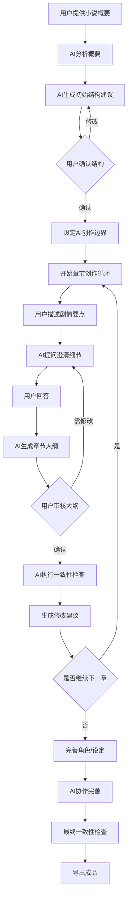

### 4.2 分级制度与AI约束系统

#### 4.2.1 分级制度矩阵

```json
{
  "ratings": {
    "G": {
      "description": "全年龄适宜",
      "violence": 0,
      "romance": 0,
      "language": 0,
      "themes": ["友情", "成长", "冒险"],
      "prohibited": ["暴力", "恋爱情节", "粗俗语言"]
    },
    "PG": {
      "description": "家长指导",
      "violence": 2,
      "romance": 1,
      "language": 1,
      "themes": ["轻度冲突", "温和情感"],
      "prohibited": ["血腥暴力", "激烈恋爱", "脏话"]
    },
    "PG-13": {
      "description": "13岁以上适宜",
      "violence": 4,
      "romance": 3,
      "language": 3,
      "themes": ["动作冲突", "恋爱关系", "成人话题"],
      "prohibited": ["极端暴力", "性描写", "严重脏话"]
    },
    "R": {
      "description": "17岁以上",
      "violence": 7,
      "romance": 6,
      "language": 6,
      "themes": ["暴力冲突", "成熟恋爱", "复杂主题"],
      "prohibited": ["极端血腥", "详细性描写"]
    },
    "NC-17": {
      "description": "成人内容",
      "violence": 10,
      "romance": 10,
      "language": 10,
      "themes": ["无限制"],
      "prohibited": ["违法内容"]
    }
  }
}
```

### 4.3 AI协作对话流程设计

#### 4.3.1 章节创作对话流程

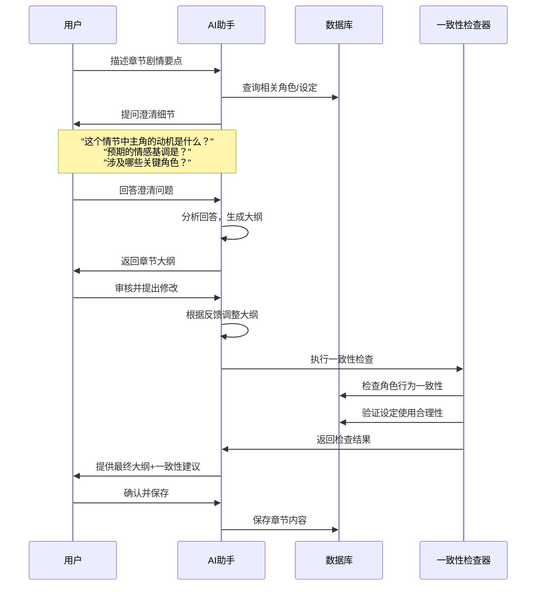

#### 4.3.2 角色完善对话流程

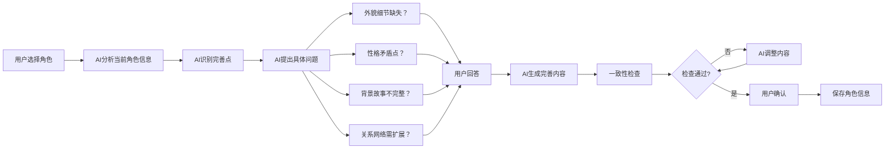

## 5. 用户界面与交互设计

### 5.1 整体布局设计

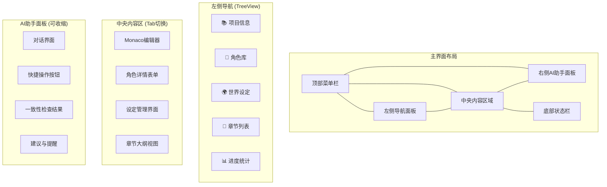

### 5.2 核心界面设计详图

#### 5.2.1 界面布局关系图

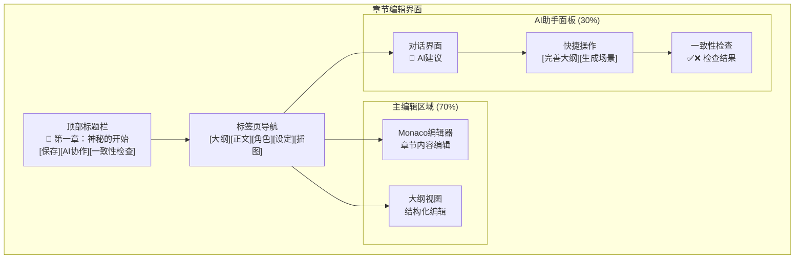

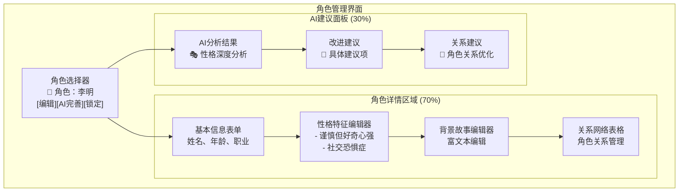

#### 5.2.2 界面组件详细设计

**章节编辑界面组件**

1. **顶部工具栏**
   - 章节标题显示：📄 第一章：神秘的开始
   - 操作按钮：保存、AI协作、一致性检查
   - 状态指示：编辑状态、保存状态、同步状态

2. **标签页导航**
   - 大纲：结构化章节规划
   - 正文：Monaco编辑器
   - 角色：当前章节涉及角色
   - 设定：相关世界设定
   - 插图：插图位置标记

3. **主编辑区域功能**
   ```markdown
   ## 章节大纲示例
   
   ### 开场设定
   - 时间：深夜
   - 地点：废弃工厂
   - 主角：李明（紧张、好奇）
   
   ### 关键情节
   1. 发现神秘线索
   2. 遭遇未知危险
   3. 勉强脱险，获得重要信息
   
   ### 插图位置标记
   [插图：主角发现线索 - 场景1]
   [插图：废弃工厂外观 - 开场]
   ```

4. **AI助手面板功能**
   - 对话交互：智能问答和建议
   - 快捷操作：一键完善、生成、检查
   - 实时反馈：一致性检查结果显示

**角色管理界面组件**

1. **角色信息编辑**
   ```yaml
   基本信息:
     姓名: 李明
     年龄: 28岁
     职业: 私人侦探
     外貌: 中等身材，深褐色头发
   
   性格特征:
     - 谨慎但好奇心强
     - 有轻微的社交恐惧症
     - 对细节异常敏感
   
   背景故事:
     出生于小镇，父亲失踪事件让他走上侦探道路...
   ```

2. **关系网络管理**
   | 角色 | 关系类型 | 关系状态 | 重要程度 |
   |------|----------|----------|----------|
   | 王警官 | 导师 | 紧张但信任 | 高 |
   | 小雨 | 助手 | 依赖关系 | 中 |
   | 神秘客户 | 委托人 | 互相试探 | 高 |

3. **AI智能建议**
   - 性格深度分析
   - 关系网络优化建议
   - 角色发展弧线规划
   - 与情节的一致性建议

### 5.3 AI交互设计规范

#### 5.3.1 对话界面交互流程

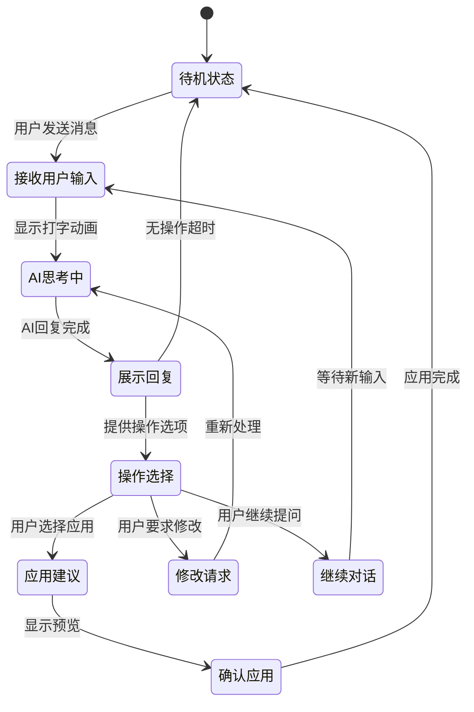

#### 5.3.2 快捷操作按钮设计

| 按钮名称 | 功能说明 | 图标 | 热键 |
|---------|---------|------|------|
| 完善角色 | AI分析并完善当前角色 | 🎭 | Ctrl+Shift+C |
| 扩展设定 | AI扩展当前世界设定 | 🌍 | Ctrl+Shift+W |
| 生成大纲 | AI为章节生成详细大纲 | 📋 | Ctrl+Shift+O |
| 一致性检查 | 执行全面一致性检查 | 🔍 | Ctrl+Shift+K |
| 插图建议 | AI建议插图位置和描述 | 🖼️ | Ctrl+Shift+I |
| 导出预览 | 预览最终导出效果 | 📄 | Ctrl+Shift+P |

## 6. 一致性检查引擎设计

### 6.1 一致性检查类型矩阵

| 检查类型 | 检查内容 | 算法模型 | 严重程度判断 |
|---------|---------|---------|-------------|
| 角色一致性 | 性格特征、行为模式、对话风格 | 语义相似度 + 规则匹配 | 高：性格完全相反；中：行为不符；低：对话风格偏差 |
| 设定逻辑性 | 世界观规则、地理位置、时代背景 | 逻辑推理 + 知识图谱 | 高：规则矛盾；中：位置错误；低：细节不符 |
| 时间线验证 | 事件顺序、角色年龄、季节变化 | 时序分析 + 约束检查 | 高：时间倒流；中：年龄矛盾；低：季节不符 |
| 情节连贯性 | 因果关系、动机合理性、结果逻辑 | 因果链分析 + 逻辑验证 | 高：逻辑断裂；中：动机不足；低：细节缺失 |

### 6.2 一致性检查流程图

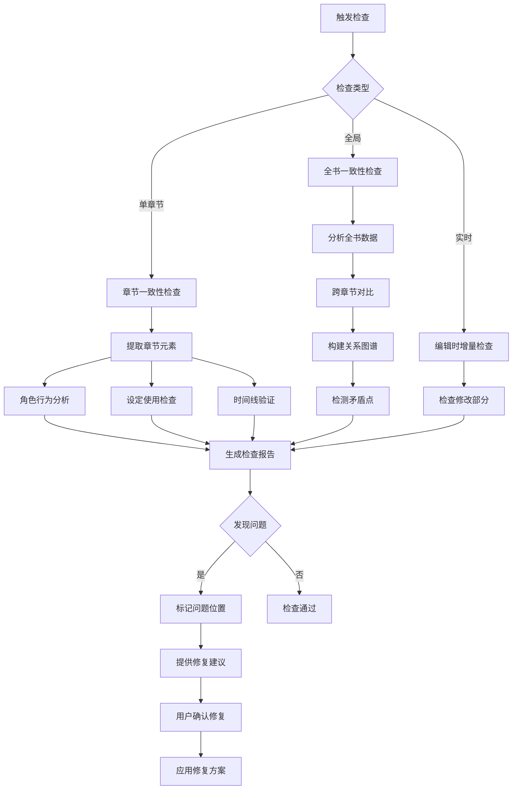

## 7. 导出系统设计

### 7.1 导出格式支持矩阵

| 格式 | 支持特性 | 技术实现 | 插图处理 |
|------|---------|---------|----------|
| EPUB | 章节分页、目录、元数据、嵌入字体 | epub-gen + JSZip | 转换为base64嵌入 |
| TXT | 纯文本、章节分隔、编码选择 | fs-extra + iconv | 插图位置保留标记 |
| HTML | 网页预览、响应式布局、打印友好 | 模板引擎 + CSS | 标签引用 |
| PDF | 专业排版、页眉页脚、书签 | Puppeteer + Chrome | 矢量/位图混排 |

### 7.2 插图处理工作流

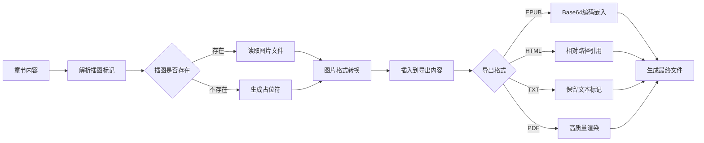

## 8. 开发计划与里程碑

### 8.1 项目里程碑规划

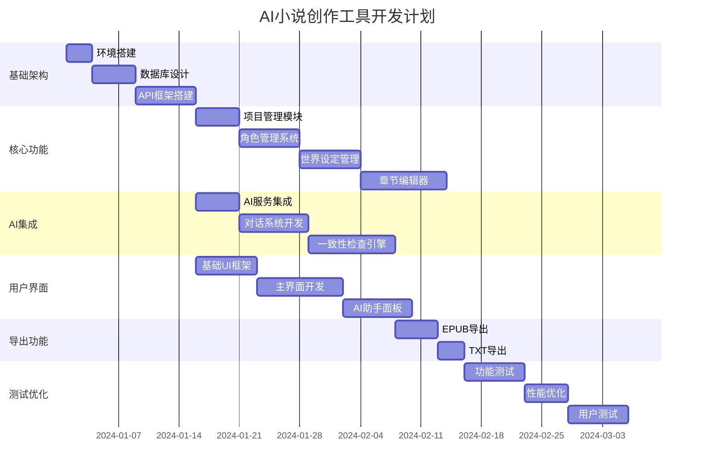

### 8.2 技术风险与缓解方案

| 风险项 | 风险等级 | 影响 | 缓解方案 |
|--------|---------|------|----------|
| AI API稳定性 | 中 | 协作功能中断 | 支持多个AI服务商，本地模型备选 |
| 数据一致性 | 高 | 数据丢失/损坏 | 自动备份、事务处理、版本控制 |
| 性能问题 | 中 | 大项目响应慢 | 分页加载、缓存机制、索引优化 |
| 用户体验 | 低 | 学习成本高 | 引导教程、快捷操作、智能提示 |

## 9. 总结与后续规划

### 9.1 核心价值主张

- 智能协作：AI深度参与创作过程，不只是简单的文本生成
- 一致性保障：自动检测并修复角色、设定、情节的矛盾
- 专业工具：代码编辑器级别的交互体验，适合长篇创作
- 完整工作流：从概要到成品，全流程AI辅助

### 9.2 技术特色

- 本地化存储：每个项目独立数据库，保护创作隐私
- 模块化架构：易于扩展新的AI服务和导出格式
- 实时协作：边写边检查，即时反馈和建议
- 专业导出：支持多种发布格式，满足不同需求

### 9.3 开发优先级建议

- **Phase 1 (MVP)：**基础项目管理 + 简单AI对话 + 基本导出
- **Phase 2 (增强)：**一致性检查 + 完整AI协作 + UI优化
- **Phase 3 (专业)：**高级导出 + 性能优化 + 扩展功能
